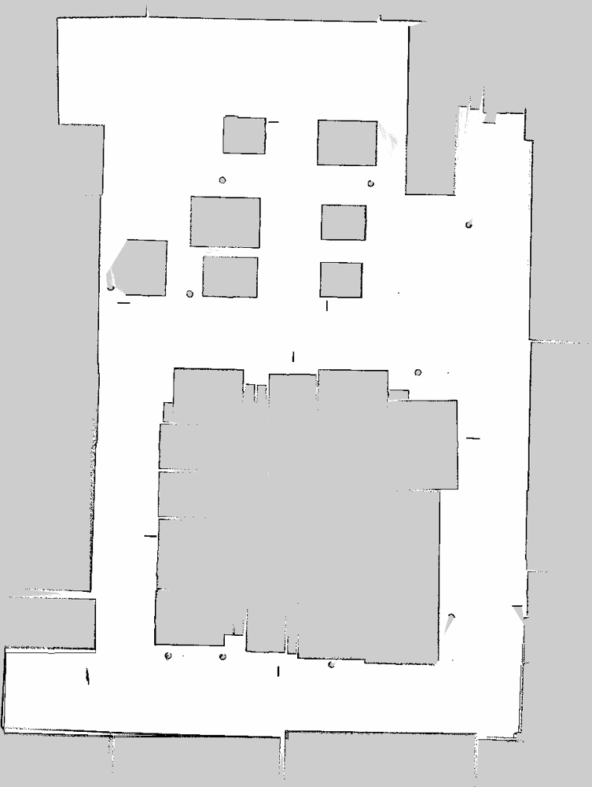

# AMR — Autonomous Mobile Robot

A two-phase autonomous delivery robot built on **ROS 2 Humble + Nav2 + Gazebo (gz-sim)**.

The robot first explores and maps an urban city-town environment from scratch (Phase 1), then in Phase 2 it loads the saved map and executes multi-step delivery missions (Grocery, Food, Fire emergency, …) between QR-tagged landmarks (DOCK, HOUSE_1..5, FIRE_STATION, RESTAURANT, SUPERMARKET). Dynamic obstacles (small patrol bots and user-dropped cylinders) are detected via lidar and avoided in real time.



---

## Architecture at a glance

```
                 PHASE 1 (mapping)                          PHASE 2 (mission execution)
                 ─────────────────                          ───────────────────────────
  Gazebo  ─┐                                  Gazebo  ─┐
           ├─→ gz-bridge ──→ /scan, /odom              ├─→ gz-bridge ──→ /scan, /odom
           └─→ /camera*/image_raw                      └─→ /camera*/image_raw
              │                                            │
              ▼                                            ▼
  EKF (robot_localization)                       EKF + AMCL (loaded saved map)
              │                                            │
  slam_toolbox  ◄──── explore_lite                 Nav2 stack (MPPI + costmaps)
              │                                            │
  qr_localizer (4 cameras)                          qr_localizer (still detects)
              │                                            │
       landmarks.yaml                              landmark_mission_gui (Tkinter)
       saved_map.{yaml,pgm}                        + patrol_controller (obstacle bots)
```

---

## Hardware (simulated)

- **Chassis**: 2.0 m × 1.0 m × 0.5 m diff-drive box
- **Wheels**: radius 0.4 m, separation 1.2 m
- **Lidar**: 360° planar, 720 samples, range 0.12–20 m (mounted at z ≈ 0.9 m)
- **Cameras**: 4 × RGB 640×480 @ 20 Hz, ~80° HFoV
  - `camera_frame` — forward
  - `camera_left_frame` — +45° yaw
  - `camera_right_frame` — −45° yaw
  - `camera_back_frame` — 180°
- **IMU**: 100 Hz, mounted at z = 0.15 m
- **Bumpers**: 4 contact sensors (front, rear, left, right)

Plus two **patrol bots** (1/3 scale diff-drive) that loop hand-picked routes during Phase 2 as dynamic obstacles.

---

## Prerequisites

- Ubuntu 22.04
- ROS 2 Humble (`source /opt/ros/humble/setup.bash`)
- Gazebo Garden / Fortress (installed via `ros-humble-ros-gz-sim`)

## Install

```bash
# System / ROS packages
sudo apt update
xargs -a apt-requirements.txt sudo apt install -y

# Python packages
pip3 install -r requirements.txt
```

`explore_lite` is not always available as a binary. If `ros-humble-explore-lite` isn't found, clone it into your ROS 2 workspace (`/home/<you>/ros2_ws/src/`) from the [m-explore-ros2](https://github.com/robo-friends/m-explore-ros2) repo and rebuild with `colcon build`.

> **Note on paths**: the launch files currently use absolute paths (`/home/hadi/amr_project/...`). If you clone this repo to a different location, do a search-and-replace in `scripts/*.launch.py` for the new path.

---

## Quick start

See **[LAUNCH_GUIDE.md](LAUNCH_GUIDE.md)** for full details. The two main commands:

```bash
# Phase 1 — explore and save the map (one-shot, ~5–10 min depending on map size)
ros2 launch /home/hadi/amr_project/scripts/bringup_all.launch.py

# Phase 2 — load saved map, run missions
ros2 launch /home/hadi/amr_project/scripts/phase2.launch.py
```

---

## Project layout

```
amr_project/
├── README.md                  ← you are here
├── LAUNCH_GUIDE.md            ← command reference + RViz tips
├── requirements.txt           ← Python deps
├── apt-requirements.txt       ← system / ROS 2 deps
├── presentation.tex           ← 5-slide Beamer presentation skeleton
│
├── scripts/                   ← launch files + ROS 2 nodes
├── sdf/                       ← Gazebo world + robot model
├── param/                     ← Nav2 / SLAM / EKF / GUI configs
├── maps/                      ← saved maps (PGM + YAML)
└── docs/
    └── images/                ← screenshots for README
```

### `scripts/` — launch files and ROS 2 nodes

| File | Role |
|------|------|
| `bringup_all.launch.py` | **Phase 1 entry point**: Gazebo, bridges, EKF, slam_toolbox, RViz, qr_localizer, Nav2 (for explore_lite to drive), bumper_escape, and `explore_and_save_map.py`. |
| `phase2.launch.py` | **Phase 2 entry point**: Gazebo, bridges, EKF, AMCL with saved map, Nav2, RViz, bumper_escape, mission GUI, patrol bots + patrol bridge + patrol_controller. |
| `gz_bridge.launch.py` | Gazebo↔ROS bridge: `parameter_bridge` for sensors using the YAML config + `image_bridge` for the 4 camera streams + static_transform_publishers for chassis-to-frame transforms (lidar, cameras, imu). |
| `nav2_no_docking.launch.py` | Brings up the Nav2 navigation stack (controller_server, planner_server, behavior_server, bt_navigator, smoother_server, waypoint_follower, velocity_smoother, collision_monitor) using `param/nav2_chassis_params.yaml`. |
| `explore_and_save_map.py` | Wraps `explore_lite`: watches its stdout, detects exploration end, waits a configurable delay, then calls `nav2_map_server map_saver_cli` to save `maps/saved_map.{yaml,pgm}`. |
| `qr_localizer.py` | Subscribes to all 4 camera streams. Detects QR codes with pyzbar, computes bearing from camera intrinsics, fuses with lidar range, writes results into `param/landmarks.yaml` (quality-weighted mean across sightings). One OpenCV window per camera. |
| `bumper_escape_node.py` | Watches the 4 bumper sensors. On contact, publishes a short reverse + turn `Twist` to `/cmd_vel` to escape the wall. |
| `landmark_mission_gui.py` | Tkinter "AMR Phase 2 Control Center". Two tabs: "Go to specific location" (direct goal to any landmark) and "Assign mission" (pre-defined multi-step routes). Includes a no-progress watchdog and per-leg failure tolerance. |
| `landmark_nav_gui.py` | Simpler direct-only GUI (without mission scheduling). |
| `landmark_goal_sender.py` | Headless utility: send a single `NavigateToPose` to a named landmark from the CLI. |
| `patrol_controller.py` | Loads `param/patrol_routes.yaml`. Drives the two patrol bots (`patrol_bot_1`, `patrol_bot_2`) back-and-forth between waypoints using dead-reckoning + a turn-then-drive controller. |
| `coverage_tour.py` | Standalone tool: subscribes to `/map`, generates a free-space waypoint grid via `scipy.ndimage.distance_transform_edt`, then visits each via `NavigateToPose` with optional in-place rotation. Currently not wired into the launch chain — manual run only. |

### `sdf/` — Gazebo world and robot model

| File | Role |
|------|------|
| `bigsmol.sdf` | Main world: city-town with streets, buildings, QR sign models, lights, patrol bots, and a parked `moving_cyl_1` test cylinder. |
| `service_robot/model.sdf` | Robot model: chassis link, 4 cameras (with frames), lidar, IMU, 4 bumper sensors, 2 wheels + caster, diff-drive plugin. |
| `service_robot/model.config` | Model metadata for Gazebo. |
| `qr_codes/*.png` | QR code images used by sign models in the world. |

### `param/` — configuration

| File | Role |
|------|------|
| `nav2_chassis_params.yaml` | **The** Nav2 navigation params: bt_navigator, controller_server (MPPI), planner_server, costmaps (with dual-inflation for dynamic obstacles), collision_monitor, behavior_server, etc. Used by `nav2_no_docking.launch.py` in both phases. |
| `nav2_chassis_localization_params.yaml` | AMCL + map_server params loaded by `nav2_bringup/localization_launch.py` during Phase 2. |
| `mapper_params_online_async.yaml` | slam_toolbox online-async params (Phase 1 only). |
| `ekf.yaml` | `robot_localization` EKF: fuses wheel odom + IMU into `/odometry/filtered`. |
| `explore_params.yaml` | explore_lite tunables for Phase 1 frontier exploration. |
| `ros2_gz_bridge_topics.yaml` | ros_gz_bridge bidirectional/unidirectional topic mappings (/cmd_vel, /scan, /odom, /imu, bumpers, all 4 camera_info topics). |
| `patrol_routes.yaml` | Two patrol routes: spawn pose + waypoints + speed + pause for each bot. |
| `landmarks.yaml` | **Output** of `qr_localizer.py`: detected QR landmarks with QR pose + approach pose + fusion stats. Consumed by `landmark_mission_gui.py`. |
| `nav2_view.rviz` | RViz config tailored for the navigation + costmap views. |

### `maps/` — saved maps from prior runs

Multiple snapshots (auto-numbered each Phase 1 run). The latest is `saved_map.{yaml,pgm}` — Phase 2 loads this by default. Older numbered copies (`saved_map_1`, `saved_map_2`, …) are kept as historical references and not used unless you pass `map:=<path>` explicitly to `phase2.launch.py`.

---

## Phase 1 — mapping

1. **Launch**: `ros2 launch scripts/bringup_all.launch.py`
2. Gazebo starts, EKF + slam_toolbox + Nav2 stack come up over the next ~25 s.
3. `explore_lite` starts driving the robot toward frontiers. While it drives, `qr_localizer` (running in parallel) detects QR signs and adds them to `param/landmarks.yaml`.
4. When `explore_lite` reports "All frontiers traversed", `explore_and_save_map.py` waits 2 s, then runs `map_saver_cli` to write `maps/saved_map.yaml` and `saved_map.pgm`.
5. `landmarks.yaml` is also persisted to disk continuously by `qr_localizer` (async flush at 1 Hz).

## Phase 2 — mission execution

1. **Launch**: `ros2 launch scripts/phase2.launch.py`
2. Gazebo starts, then bridges, EKF, AMCL (loading the saved map), Nav2, RViz, patrol bots + their bridge + driver, and finally the mission GUI.
3. In RViz, use **2D Pose Estimate** to localize the robot at its starting position.
4. In the **Mission Control** GUI:
   - "Go to specific location" → pick any landmark and click *Confirm and Navigate*.
   - "Assign mission" → pick mission type + target house + *Start Mission*.
5. While the robot navigates, drop a cylinder in its path in Gazebo (right-click → spawn → cylinder) to test dynamic obstacle avoidance.

---

## Dynamic obstacle avoidance

Both costmaps subscribe to live `/scan`:

- **Local costmap** (`obstacle_layer` + `inflation_layer`, rolling 12×12 m window, 1.29 m inflation) — MPPI uses it for trajectory selection.
- **Global costmap** (`static_layer` + `inflation_layer` for walls + `obstacle_layer` + `obstacle_inflation_layer` for live obstacles) — the planner re-routes around live obstacles at ~1 Hz. Walls get a 1.5 m halo; new (`/scan`-only) obstacles get a smaller 0.3 m halo so the planner can find detours through tight streets.

MPPI's `PathAlignCritic` keeps the robot loosely on the path; `CostCritic` pushes it away from the inflated obstacle. `PathAlignCritic` auto-disables when >7% of the current path is blocked, freeing MPPI to deviate.

Behavior tree replans the global path roughly every second; the local controller follows whatever the latest path is. A `collision_monitor` is wired into the lifecycle stack as a final safety stop.

---

## Mission GUI features

- **Live progress** display ("HOUSE_3 — Distance remaining: 0.28 m")
- **Goal tolerance**: 0.7 m XY, 180° yaw (yaw is intentionally permissive so the robot doesn't waste time rotating in place after arriving)
- **Watchdog**: cancels + retries the current goal if `distance_remaining` doesn't drop by 0.5 m within 30 s
- **Per-leg failure tolerance**: a failed/canceled step in a multi-step mission is skipped — the mission continues with the next leg instead of aborting

---

## Troubleshooting cheatsheet

| Symptom | Likely cause | Fix |
|---------|-------------|-----|
| Robot stops in front of obstacle, never moves | Global costmap not seeing the obstacle | Check `ros2 topic info /scan -v` for publishers; check `ros2 run tf2_ros tf2_echo map lidar_frame` resolves; confirm `max_obstacle_height: 2.0` is set in `nav2_chassis_params.yaml` global_costmap obstacle_layer |
| Mission cancels at every leg even though robot arrives | Yaw tolerance too tight | `yaw_goal_tolerance: 3.14` in `nav2_chassis_params.yaml` |
| Cylinders / patrol bots stop publishing into Gazebo | Missing ROS↔Gz bridge | Inline bridge in `phase2.launch.py` for `/patrol_*/cmd_vel` (see section 7a in that launch file) |
| Patrols spawn outside the city | SDF spawn pose vs map-frame mismatch | Patrol coords are in **Gazebo world frame**, which is offset from the SLAM map frame by `(-39.9, -29.6)` — `param/patrol_routes.yaml` documents this offset |

---

## Known limitations

- Launch files use absolute paths (`/home/hadi/amr_project/...`) — need editing on clone.
- Detected landmark coordinates depend on the robot's starting pose during SLAM. Re-mapping shifts all landmark positions; Phase 2 navigation works as long as you also re-set the initial pose in RViz at the same spot you started SLAM.
- `coverage_tour.py` is not wired into either launch; run it manually if you want grid coverage after mapping.

---

## Documentation

- `LAUNCH_GUIDE.md` — full command reference, RViz setup steps, debug commands.
- `presentation.tex` — 5-slide Beamer summary (compile with `pdflatex presentation.tex`).
